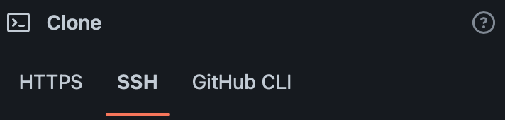
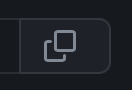

# Workshop React life cycle

## Setup

1. Create the repository from this template by click at "Use this template".
2. Named the repository "workshop-react-life-cycle".
3. Click at "Create repository from template".
4. Wait for a moment, after successful created the repository clone it to your local machine by:

    4.1 Click at Code button.  


    4.2 Click at SSH.  


    4.3 Click at Copy button.  


    4.4 Run the command you just copied in terminal to clone the reposiroty.

## Run

Type this command in terminal

```js
npm install
npm start
```

Then open brower with url

```text
http://localhost:3000
```

## How to

1. At file src/App.js uncomment **Mounting** component (line 14).
2. At Chrome, open JavaScript console by **Command+Option+J** (Mac) or **Control+Shift+J** (Windows).
3. From the log try to investigate the order of fucntion get called by React.

4. At file src/App.js comment **Mounting** component (line 14), uncomment **Updating** component (line 15), Go back to Chrome to see the log.

5. At file src/App.js comment **Updating** component (line 15), uncomment **Unmounting** component (line 16), Go back to Chrome and try to click button to toggle the clock and see the log.

6. At file src/App.js comment **Unmounting** component (line 16), uncomment **CheckLifeCycle** component (line 17) and try to comment - uncomment the following step and see the log  

    6.1 Comment *componentDidMount* function at **CheckLifeCycle** component. The clock is stopped, why?  

    6.2 Uncomment *componentDidMount* function at **CheckLifeCycle** component, Comment *getDerivedStateFromProps* function at **CheckLifeCycleChild** component. The clock still not works, why?  

    6.3 Comment *componentDidMount* function at **CheckLifeCycle** component, Uncomment *componentDidMount* function at **CheckLifeCycleChild** component. The clock is now working, why?  

    Try to play around and see the changed in log.
